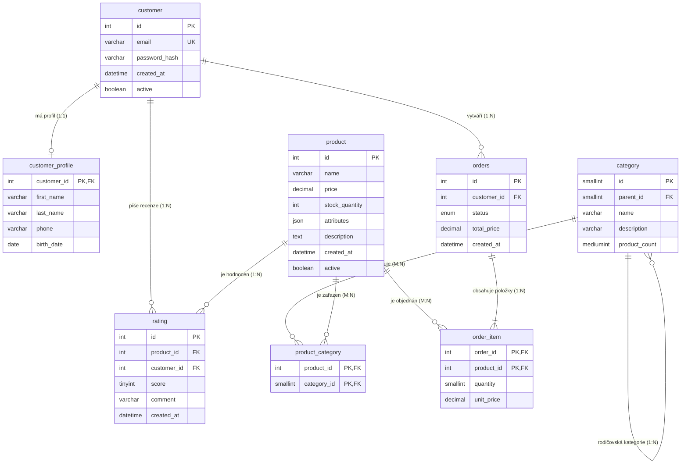

# EDU ESHOP (Výuková relační databáze)

Demo databáze elektronického obchodu pro účely výuky databázových předmětů na SŠ a VOŠ (předměty **DAT10, DAT20, DAT30** a příprava k absolutoriu).

Databáze slouží jako názorný příklad moderní e-commerce databáze pokrývající klíčové koncepty relačního modelování, jazyka SQL, integrity dat, pokročilých struktur i programovatelných objektů.

- **Online interaktivní diagram:** [dbdiagram.io/d/edu_eshop-6aaa9e57af7c3b0bd1f594b2](https://dbdiagram.io/d/edu_eshop-6aaa9e57af7c3b0bd1f594b2)

---

## Přehled souborů

| Soubor | Popis |
|---|---|
| `edu_eshop.sql` | Kompletní DDL skript (definice tabulek, primárních/cizích klíčů, CHECK omezení, triggerů, pohledů a testovacích dat). |
| `edu_eshop.dbml` | Definice schématu ve formátu **DBML (Database Markup Language)** pro nástroje jako [dbdocs.io](https://dbdocs.io) a [dbdiagram.io](https://dbdiagram.io). |
| `edu_eshop.dbdiagram` | Konfigurační soubor diagramu pro vizualizaci na [dbdiagram.io](https://dbdiagram.io). |
| `README.md` | Tato detailní dokumentace databáze a výukový průvodce. |

---

## Konceptuální a relační architektura

Model reprezentuje zjednodušený, ale realistický provoz internetového obchodu:
- **Zákazníci** mají svůj autentizační účet a volitelný podrobný profil (vztah 1:1).
- **Katalog produktů** je organizován do stromu kategorií s neomezeným zanořením (sebereference 1:N) a produkty mohou patřit do více kategorií současně (vztah M:N).
- **Zákaznická hodnocení** umožňují recenzovat a hodnotit zakoupené produkty (vztah 1:N).
- **Objednávkový systém** eviduje nákupní košíky / objednávky v různých stavech a jejich jednotlivé položky s historickou prodejní cenou.

### ER Diagram (Mermaid)

---

## Detailní popis entit a sloupců

### 1. `customer` (Zákaznický účet)
Uchovává základní přihlašovací identitu uživatele.
- `id` (`INT`, PK, `AUTO_INCREMENT`): Unikátní identifikátor zákazníka.
- `email` (`VARCHAR(100)`, `UNIQUE`, `NOT NULL`): Přihlašovací e-mail, nesmí se opakovat.
- `password_hash` (`VARCHAR(255)`, `NOT NULL`): Bezpečný hash hesla (např. bcrypt/Argon2).
- `created_at` (`DATETIME`, `DEFAULT NOW()`): Čas registrace.
- `active` (`BOOLEAN`, `DEFAULT TRUE`): Příznak stavu účtu (pro soft delete / blokaci).

### 2. `customer_profile` (Osobní profil zákazníka – Vazba 1:1)
Oddělení citlivých osobních údajů od přihlašovacích (demonstrace 1:1 a vertikální fragmentace).
- `customer_id` (`INT`, PK, FK -> `customer.id` `ON DELETE CASCADE`): Sdílený primární klíč zajišťující kardinalitu 1:1.
- `first_name` (`VARCHAR(50)`, `NOT NULL`): Jméno.
- `last_name` (`VARCHAR(50)`, `NOT NULL`): Příjmení.
- `phone` (`VARCHAR(20)`): Telefonní číslo.
- `birth_date` (`DATE`): Datum narození (vhodné pro výpočet věku funkcemi SQL).

### 3. `category` (Kategorie produktů – Sebereference / Stromová hierarchie)
Hierarchický strom kategorií s udržovaným počítadlem.
- `id` (`SMALLINT`, PK, `AUTO_INCREMENT`): Šetří paměť (pro tisíce kategorií plně dostačuje).
- `parent_id` (`SMALLINT`, FK -> `category.id` `ON DELETE SET NULL`): Odkaz na nadřazenou kategorii (NULL = kořenová kategorie).
- `name` (`VARCHAR(100)`, `NOT NULL`): Název kategorie.
- `description` (`VARCHAR(255)`): Popis kategorie.
- `product_count` (`MEDIUMINT`, `DEFAULT 0`): Denormalizovaný agregát automaticky synchronizovaný **databázovými triggery**.

### 4. `product` (Zboží / Produkty – Relační data + NoSQL JSON)
Katalogové položky s pevnými i dynamickými vlastnostmi.
- `id` (`INT`, PK, `AUTO_INCREMENT`): Primární klíč produktu.
- `name` (`VARCHAR(150)`, `NOT NULL`): Název zboží.
- `price` (`DECIMAL(10,2)`, `NOT NULL`, `CHECK (price >= 0)`): Prodejní cena bez plovoucí řádové čárky (eliminace zaokrouhlovacích chyb).
- `stock_quantity` (`INT`, `DEFAULT 0`, `CHECK (stock_quantity >= 0)`): Počet kusů skladem.
- `attributes` (`JSON`): Polostrukturovaná data (např. `{"color": "black", "ram_gb": 16, "screen_inch": 6.1}`).
- `description` (`TEXT`): Dlouhý popis produktu.
- `created_at` (`DATETIME`, `DEFAULT NOW()`): Datum zařazení do nabídky.
- `active` (`BOOLEAN`, `DEFAULT TRUE`): Aktivita nabídky.

### 5. `product_category` (Vazební tabulka M:N)
Dekompozice vztahu M:N mezi produkty a kategoriemi.
- `product_id` (`INT`, PK, FK -> `product.id` `ON DELETE CASCADE`)
- `category_id` (`SMALLINT`, PK, FK -> `category.id` `ON DELETE CASCADE`)
- *Složený primární klíč* `(product_id, category_id)` zamezuje duplicitnímu zařazení produktu do stejné kategorie.

### 6. `rating` (Uživatelské recenze a hodnocení)
Zpětná vazba od zákazníků k produktům.
- `id` (`INT`, PK, `AUTO_INCREMENT`): Identifikátor recenze.
- `product_id` (`INT`, FK -> `product.id` `ON DELETE CASCADE`): Hodnocený produkt.
- `customer_id` (`INT`, FK -> `customer.id` `ON DELETE CASCADE`): Autor recenze.
- `score` (`TINYINT`, `NOT NULL`, `CHECK (score BETWEEN 1 AND 5)`): Počet hvězdiček 1 až 5.
- `comment` (`VARCHAR(255)`): Slovní zhodnocení.
- `created_at` (`DATETIME`, `DEFAULT NOW()`): Čas vložení recenze.
- *Unikátní integritní omezení* `UNIQUE KEY (customer_id, product_id)`: Jeden zákazník může hodnotit daný produkt maximálně jednou.

### 7. `orders` (Hlavička objednávky)
Záznam obchodní transakce.
- `id` (`INT`, PK, `AUTO_INCREMENT`): Číslo objednávky.
- `customer_id` (`INT`, FK -> `customer.id` `ON DELETE RESTRICT`): Zákazník nesmí být smazán, pokud má existující účetní záznamy.
- `status` (`ENUM('new', 'paid', 'shipped', 'cancelled')`, `DEFAULT 'new'`): Výčtový typ stavu objednávky.
- `total_price` (`DECIMAL(10,2)`, `DEFAULT 0.00`, `CHECK (total_price >= 0)`): Celková cena objednávky.
- `created_at` (`DATETIME`, `DEFAULT NOW()`): Datum a čas vytvoření objednávky.

### 8. `order_item` (Položky objednávky – M:N mezi Orders a Product)
Jednotlivé položky nákupu.
- `order_id` (`INT`, PK, FK -> `orders.id` `ON DELETE CASCADE`): Smazáním objednávky zanikají její řádky.
- `product_id` (`INT`, PK, FK -> `product.id` `ON DELETE RESTRICT`): Produkt nelze natvrdo smazat z DB, pokud figuruje v historické objednávce.
- `quantity` (`SMALLINT`, `DEFAULT 1`, `CHECK (quantity > 0)`): Počet kusů.
- `unit_price` (`DECIMAL(10,2)`, `NOT NULL`, `CHECK (unit_price >= 0)`): **Historická jednotková cena** platná v okamžiku nákupu (důležitá ukázka denormalizace proti budoucí změně ceny v `product.price`).

---

## Výukové cíle a pokrytí modulů (DAT10, DAT20, DAT30)

Tato databáze byla cíleně navržena pro demonstraci všech zásadních témat probíraných v sylabu a otázkách k absolutoriu:

### 1. Návrh a konceptuální modelování (DAT10)
- **Kardinality vazeb:**
  - **1:1** (`customer` <-> `customer_profile`) se sdíleným primárním klíčem.
  - **1:N** (`orders` <-> `order_item`, `customer` <-> `orders`, `product` <-> `rating`).
  - **M:N** (`product` <-> `category`, `orders` <-> `product`) řešené asociačními tabulkami.
  - **1:N rekurzivní vazba / sebereference** (`category.parent_id` -> `category.id`) pro modelování stromových struktur.
- **Normalizace (1. NF, 2. NF, 3. NF, BCNF):**
  - Všechny tabulky jsou v 3. NF.
  - Vhodná ukázka záměrné a kontrolované **denormalizace**:
    - `order_item.unit_price` chrání historickou cenu před změnami v `product.price`.
    - `category.product_count` udržuje rychlý agregát pro výpis e-shopu bez nutnosti opakovaného náročného `COUNT()` při každém zobrazení stránky.

### 2. DDL a Integritní omezení (DAT20)
- **Volba optimálních datových typů:**
  - `TINYINT`, `SMALLINT`, `MEDIUMINT`, `INT` – demonstrace šetření paměti a indexů.
  - `DECIMAL(10,2)` – demonstrace finanční matematiky vs nepřesný `FLOAT`/`DOUBLE`.
  - `BOOLEAN` (alias pro `TINYINT(1)`).
  - `DATE` vs `DATETIME` a práce s výchozí funkcí `DEFAULT (NOW())`.
  - `ENUM` – pevně vymezená množina hodnot bez nutnosti číselníku.
  - `JSON` – ukládání nestrukturovaných parametrů a hybridní NoSQL model.
- **Integritní omezení:**
  - `PRIMARY KEY` (jednoduchý i složený přirozený klíč).
  - `FOREIGN KEY` s explicitními pravidly `ON DELETE CASCADE`, `ON DELETE SET NULL`, `ON DELETE RESTRICT`.
  - `UNIQUE` (přihlašovací e-mail, unikátní dvojice zákazník-produkt v hodnocení).
  - `NOT NULL` vs `NULL` hodnoty.
  - `CHECK` omezení (rozsah hodnocení 1–5, kladné ceny, kladná množství).

### 3. Dotazovací jazyk DQL a DML (DAT20)
Na databázi lze demonstrovat širokou škálu dotazů:
- **Základní projekce a selekce:** `WHERE`, `AND`, `OR`, `LIKE`, `IS NULL`, `BETWEEN`.
- **Spojování tabulek (JOIN):**
  - `INNER JOIN` (objednávky a jejich položky).
  - `LEFT JOIN` (všechny produkty včetně těch, které dosud nikdo nehodnotil nebo neobjednal).
  - `Self JOIN` (spojení kategorie na jejího rodiče `c1.name AS podkategorie, c2.name AS rodic`).
- **Agregace a seskupování:**
  - `COUNT()`, `SUM()`, `AVG()`, `MIN()`, `MAX()`.
  - `GROUP BY` s podmínkami `HAVING` (např. zákazníci s celkovou útratou přes 10 000 Kč).
- **Vnořené dotazy (Subqueries):**
  - Poddotaz ve `WHERE` (`WHERE price > (SELECT AVG(price) FROM product)`).
  - Korelovaný poddotaz (`EXISTS`, `NOT EXISTS`).
  - Poddotaz ve `FROM` (odvozená tabulka).
- **JSON operace:**
  - `JSON_EXTRACT(attributes, '$.color')` nebo zkrácený operátor `attributes->>'$.ram_gb'`.

### 4. Pokročilé SQL prvky (DAT30)
- **Triggery (Spouště):**
  - Automatická inkrementace a dekrementace `category.product_count` při vložení/smazání vazby v `product_category`.
  - Automatický přepočet `orders.total_price` při změně položek objednávky.
  - Validace skladových zásob a vyvolání výjimky (`SIGNAL SQLSTATE '45000'`) při pokusu objednat více kusů, než je na skladě.
- **Pohledy (VIEW):**
  - `v_product_catalog`: Přehled produktů se seznamem kategorií a průměrnou známkou.
  - `v_order_summary`: Kompletní report objednávek se jménem zákazníka a souhrnnou statistikou.
- **Transakce (TCL) a ACID:**
  - Scénář vytvoření objednávky v transakci (`START TRANSACTION`, vložení do `orders`, vložení položek do `order_item`, snížení skladu v `product`, `COMMIT` / `ROLLBACK`).
